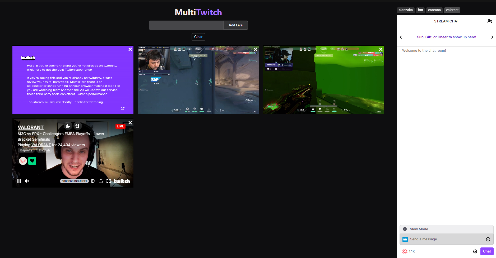

  
  
  
  

## 🎯 About

A website that allows you to view more than one live from Twitch

## :memo: Preview

## :rocket: Technologies

-  [React](https://pt-br.reactjs.org)
-  [Vite](https://vitejs.dev)

## ✍️ Author

A project made by [Bernardo Luis Patto Pinheiro](https://github.com/oBoolt).

## 🌎 License

This project in under MIT license. Check [LICENSE](https://github.com/oBoolt/multi-twitch/blob/main/LICENSE) for more information.
